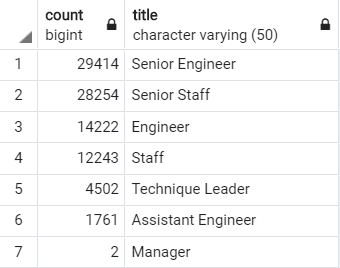
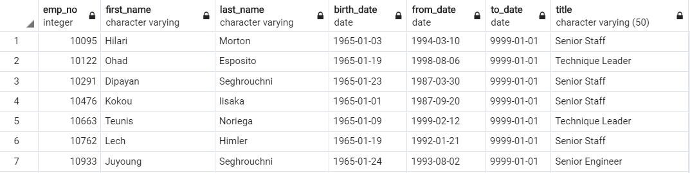
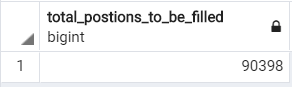
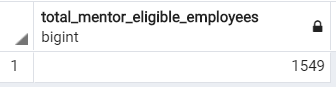

# Pewlett Hackard Analysis

## Overview of the Analysis 

The purpose of this project was to help Pewlett Hackard by providing reports to help the management prepare for the "silver tsunami" as many current employees of the organization are about to reach the retirement. To assist the management, Database containing various employee related information was created on pgAdmin and requested reports were generated by quering with postgreSQL. To do the Analysis the following reports were generated: 
- The number of retiring employees per Title 
- The number of employees eligible to participate in a new mentorship program

This report summarizes the results from the above mentioned reports. The analysis concludes by providing the management with the information for the number of roles that need to be filled and if there are enough employees in the departments to mentor the next generation of Pewlett Hackard employees. 

## Results 

### Analysis of Number of Retiring Employees per Title 

  
- From the count column we can observe that a lot of employees in the in each of the different title types will be retiring soon. 
- From the title column we can observe that a lot of employees in the management related or senior positions will retire soon leaving a big gap for leaders in the company. 

### Analysis of the number of employees eligible to participate in a new mentorship program

  
- From this report we can observe that there a lot of employees that were born in 1965, that are nearing retirement having management or senior level positions from their title column. 
- These employees who are soon to retire from this report can be eligible for mentoring in the new mentorship program that the company wants to roll out to develop the next round of leaders from within the organization.

## Summary

### Number of roles that need to be filled as the "silver tsunami" begins to make impact 

  
  
  

By performing the query on our unique_titles report which retrieved the number of employees by their most recent job title who are about to retire, we can see that a total of 90,398 titles need to filled as the "silver tsunami" begins to make impact. 

### Number of retirement ready employees in the departments to mentor the next generation of Pewlett Hackard employees.

  
  
  

By performing the query on our mentorship_eligibility report which retrieved the number of retiring soon employees born in 1965 who are eligible to serve as mentors in the company's new mentorsip prgram, we can see that a total of 1549 mentors are avaiable. This high number of retiring employees who are eligible to mentor, can mentor a lot of the current employees to take up for management positions in the future which can help Pewlett Hackard be ready for the "silver tsunami" in the horizon.
